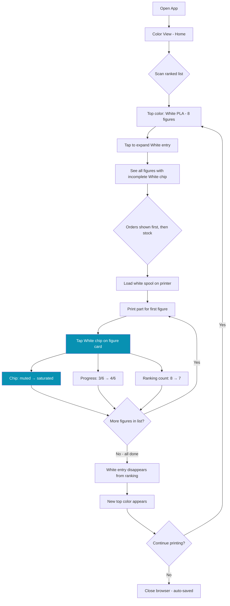
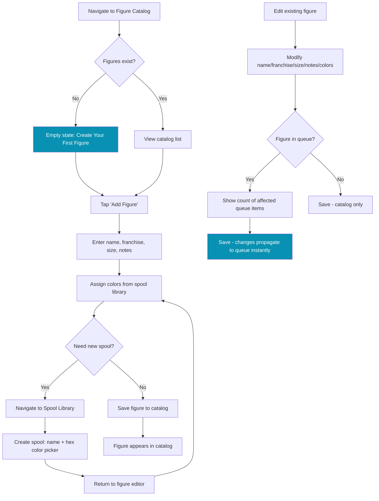
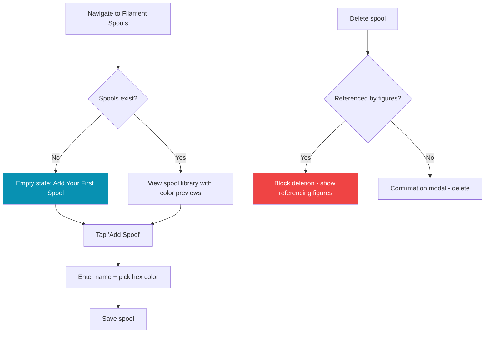
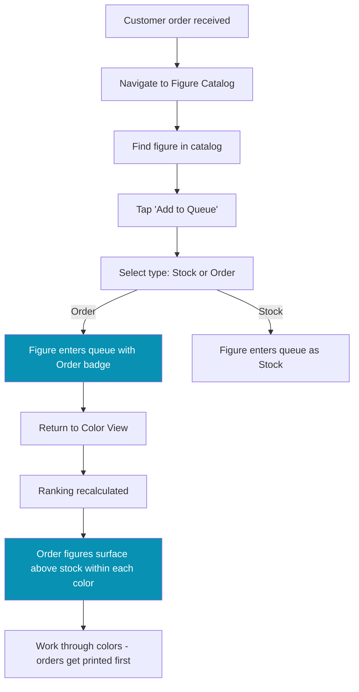
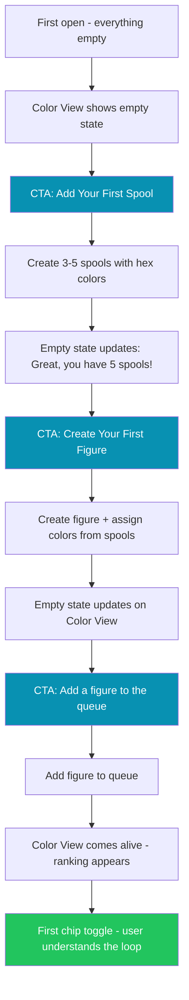
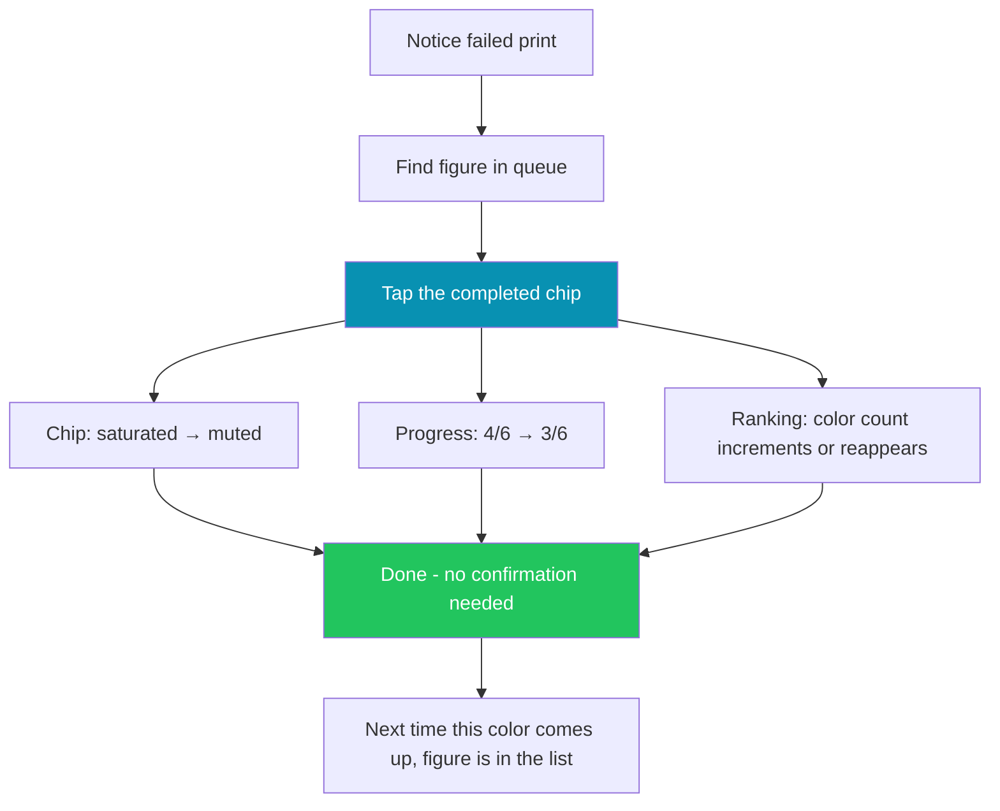
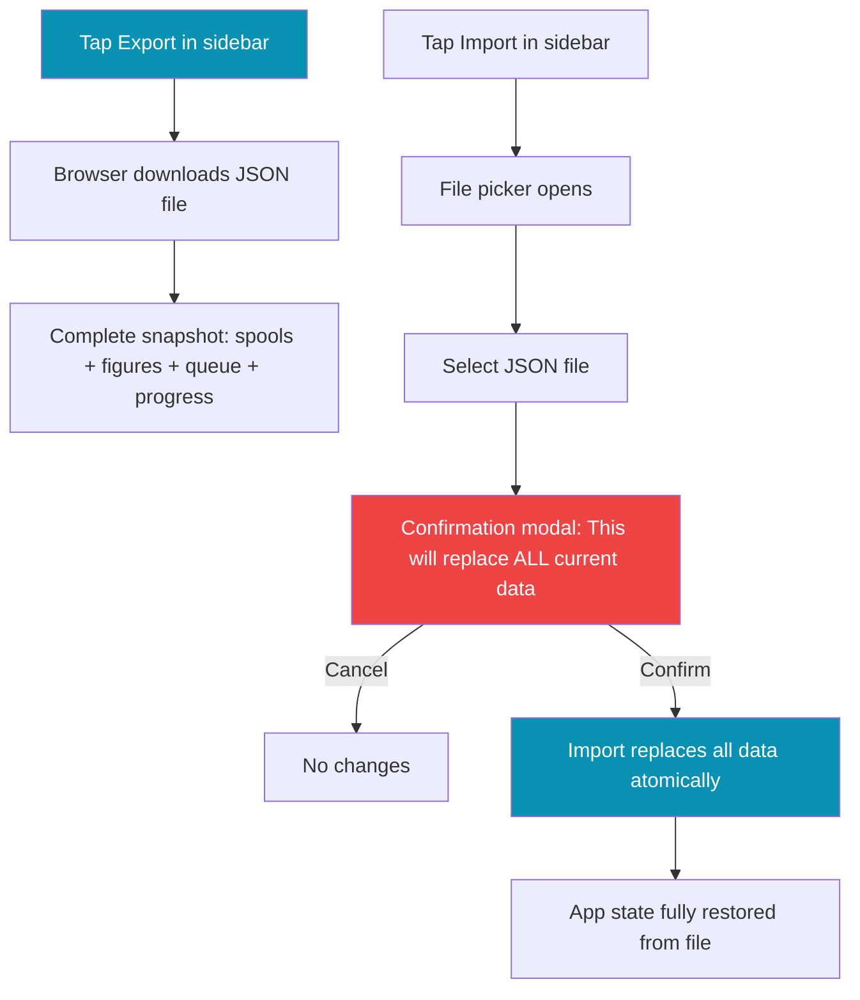

# UX Design Specification 3d-print-flow

**Author:** Paolo
**Date:** 2026-03-26

---

## Executive Summary

### Project Vision

3D Print Flow is a color-first production tracker — the only tool in the 3D printing ecosystem that treats the physically loaded filament spool as the scheduling axis. The core insight: paper fails at completeness, not planning. The operator can mentally pick the right color to load next, but cannot reliably guarantee every figure needing that color gets printed before unloading. The app closes that gap with a live color frequency ranking and per-figure color chip toggles that provide instant visual feedback and automatic progress tracking.

### Target Users

A single operator running a home-based 3D figure printing business, selling on Vinted and Subito.it. Managing 20-100+ figure designs, 5-30 active queue items, 10-30 filament spools, and two single-spool FDM printers. Desktop-first usage for planning and catalog management, with responsive mobile support for use at the printer.

### Key Design Challenges

1. **Responsive density management.** The app is desktop-first and works on mobile through responsive adaptation — same mental model, same interactions, just reflowed. The challenge is keeping information-rich views (color ranking with expandable figure lists, catalog management) usable on smaller screens without creating a separate mobile paradigm.

2. **Color as data and color as UI.** Filament colors are simultaneously data (hex values, spool identities) and visual elements (chip fills, ranking indicators). The UI must handle near-duplicate colors, very light/dark colors that may vanish against backgrounds, and ensure spools are always identifiable by name — not just hex swatch.

3. **Information density vs. scannability.** The color ranking view needs to show ranked colors, figure counts, order priority markers, and expandable figure lists — all while remaining glanceable in under 10 seconds. The balance between density and scannability defines the app's usability.

### Design Opportunities

1. **The chip toggle as signature interaction.** A satisfying tap-to-fill with progress update and completion cascade gives the app a tactile quality paper cannot match. This is the emotional hook — the moment the app earns daily-driver status. Production-grade micro-interactions make this feel premium and rewarding.

2. **Color-driven visual identity.** The user's own spool palette becomes the visual palette of their queue. Rich hex-colored chips, color-coded ranking entries, and a home view that looks different for every user because it reflects their filament shelf. The app is inherently colorful.

3. **Progressive empty-state onboarding as first impression.** With no login, no tutorial, no backend — the first-run experience IS the product demo. Empty states that teach through CTAs establish trust and competence in under 5 minutes.

## Core User Experience

### Defining Experience

The core interaction is the **color chip toggle**: tap a color chip on a queued figure to mark that color as printed. This single gesture drives the entire production loop — it updates the figure's progress, recalculates the color frequency ranking, and eventually triggers figure completion. The chip toggle is a true toggle (mark/unmark) with instant visual feedback and no confirmation for either direction.

The core loop: glance at ranked color list, pick the top color, load the spool, print parts for all listed figures, tap chips as you go. The ranking updates live with every tap. When all chips on a figure are done, it moves to completed. Repeat until the queue is empty.

### Platform Strategy

Desktop-first web application built as a React SPA with React Router v7. Responsive design adapts to mobile screens — same views, same interactions, reflowed layout. Mouse/keyboard is the primary input; touch works through responsive adaptation. No offline support, no PWA, no native app. Browser-based with IndexedDB for persistence and JSON export for portability.

**Keyboard shortcut opportunity:** As a desktop-first app for a power user, keyboard navigation within the color run (arrow keys to move between figures, space/enter to toggle chips) represents a significant efficiency gain for the production flow. Worth considering post-MVP.

### Effortless Interactions

- **Next spool decision:** Glance at the color ranking, see the top color — under 10 seconds, zero mental math
- **Chip toggling:** Instant fill/unfill with live ranking recalculation, no confirmation dialogs
- **Within-run flow:** Working through a color's figure list — toggling chip after chip within a single spool session — should feel like flowing through a list, not navigating between separate entities. The expanded color view is where production flow state happens
- **Queue addition:** Adding a catalog figure to the queue is quick and lightweight, never feels like data entry
- **Figure re-queue:** One tap on "Print Again" from completed section, back in the ranking with reset chips
- **Data export:** Always-visible action, one click to a complete JSON backup — never buried in settings

### Critical Success Moments

1. **The first ranking view** — color ranking populates and the optimal spool order becomes visible. The moment "paper can't do this" becomes visceral.
2. **The last chip** — all colors done on a figure, it completes and moves to the archive. Brief, satisfying state change — no modal, no interruption.
3. **The spool swap confidence** — unloading a spool knowing the app guaranteed every figure needing that color was printed. Zero doubt, zero missed figures.
4. **The live propagation moment** — editing a catalog figure's colors and seeing the change instantly reflected on queued instances. This is when the user realizes the app isn't a static spreadsheet — it's a live system. Trust earned through visible reactivity.
5. **The crash recovery** — opening the app after closing mid-session and finding everything exactly where it was left. The auto-save contract earns trust through invisible reliability.

### Experience Principles

1. **Trust through transparency — architecturally enforced.** The ranking is always live, always correct. Every chip toggle instantly recalculates every view. This isn't a design aspiration — it's a structural guarantee: the ranking is derived from in-memory state on every render, never stored or cached. It cannot be stale. If the user can't trust the color list, the entire value proposition collapses.
2. **One tap for reversible, modal for destructive.** Chip toggles, re-queuing, navigation — instant, no friction. Deleting spools, importing data, clearing the queue — confirmation with impact shown. No middle ground.
3. **Transparent intelligence, not hidden automation.** The app surfaces patterns the user can't see — an exhaustive count across 14 figures, an always-correct ranking. But the logic is always visible and deterministic. The ranking doesn't say "you should load white" — it says "white has the most incomplete figures." The decision always belongs to the user. Full situational awareness, zero black boxes.
4. **Color is the visual language, name is the disambiguator.** The user's spool palette is the app's palette. Hex-colored chips, ranking entries, and progress indicators create a visual system unique to each user. But color alone can't distinguish 5 shades of grey or 3 similar blues at chip size — spool names always accompany swatches to ensure every color is identifiable regardless of visual similarity.

## Desired Emotional Response

### Primary Emotional Goals

**Mastery through clarity.** The user feels complete command of their production queue — not because the app is powerful, but because it makes the complex simple. The feeling of looking at 14 figures across 10 colors and knowing exactly what to do next. Paper can't give this confidence. This app can.

### Emotional Journey Mapping

| Stage | Feeling | Driver |
|-------|---------|--------|
| First open (empty) | Curious, not overwhelmed | Progressive CTAs, clear path forward |
| First ranking view | "Oh, this is smart" | Color-first paradigm clicks — the moment paper loses |
| During a color run | Flow, momentum | Chip-after-chip toggling, progress bars advancing |
| Last chip on a figure | Quiet satisfaction | Figure completes, moves to archive — brief, clean |
| Spool swap | Confidence | Every figure was hit — zero doubt |
| Crash recovery / reopen | Relief, trust | Everything exactly as left — auto-save earns loyalty |
| Something goes wrong | Calm, not anxious | Chip un-toggle is instant. Persistence failure shows clear toast with retry |

### Micro-Emotions

- **Confidence over confusion** — the ranking is always readable, always correct. No ambiguity about what to do next
- **Accomplishment over frustration** — every chip toggle is visible progress. The progress bar filling is a micro-reward
- **Trust over skepticism** — live recalculation, auto-save, catalog propagation. The app proves itself through behavior, not promises

**Emotions to avoid:**
- **Anxiety** — "did I miss a figure?" is the exact anxiety the app exists to eliminate
- **Tedium** — data entry should never feel like work; catalog and queue management are means to an end
- **Distrust** — if the user double-checks the ranking against a manual count, trust is broken

### Design Implications

- **Confidence** → Live ranking recalculation on every interaction. No stale state. Numbers always match reality
- **Flow** → Within-run chip toggling feels like checking items off a physical list. Minimal navigation, minimal interruption
- **Satisfaction** → Chip fill animation + progress bar advance + completion cascade = layered micro-rewards
- **Calm** → Reversible actions need no confirmation. Destructive actions show impact before executing. No surprises
- **Trust** → Auto-save is invisible but provable (reopen = same state). Export always one click away. Data is sacred

### Emotional Design Principles

1. **Prove, don't promise.** Trust is earned through visible behavior — live recalculation, instant persistence, reliable state restoration — not through messaging or onboarding claims.
2. **Progress is the reward.** Every interaction should produce visible progress — a chip fills, a bar advances, a count changes. The app makes work feel like forward motion.
3. **Calm over clever.** No surprises, no hidden behaviors, no "smart" features that act without the user. The app is predictable in the best sense — it does exactly what the user expects, every time.
4. **Eliminate the anxiety paper creates.** The app's emotional raison d'etre is replacing the nagging "did I miss something?" with structural certainty. Every design choice should reinforce completeness and reliability.

## UX Pattern Analysis & Inspiration

### Inspiring Products Analysis

**Linear — Information density without overwhelm**
Linear's redesigned UI uses the LCH color space for perceptual uniformity and a "neutral canvas, chromatic data" approach — the UI chrome is desaturated so that when color appears (status dots, labels), it carries real meaning. Navigation and structure recede; the user's active content stays in focus. Their three-variable theming system generates an entire neutral palette from a single base color.

*Transferable:* Keep all UI chrome desaturated. Let filament colors be the only saturated elements on screen. Card borders, backgrounds, and text stay neutral so color chips dominate. This "neutral stage, colorful actors" approach is ideal for a color-first app.

**Coolors.co — Color as the primary interface**
The entire workspace IS color — large swatches filling the viewport, spacebar to generate, lock/unlock to freeze individual colors. The Color Inspector shows hex, RGB, HSB inline on each swatch. Proves that bold color blocks work as the main interface element, not decoration.

*Transferable:* Use generous, tappable color swatches as primary UI elements — not tiny dots. Show the filament name and figure count directly on or below each swatch. The lock metaphor maps to "this spool is loaded" mental model.

**Things 3 — The art of satisfying task completion**
Widely considered the most beautiful task management app. Checkbox animations use haptic feedback and a crisp 100-200ms animation. The Logbook view — completed tasks — provides retrospective accomplishment. Generous white space makes a productivity tool feel premium rather than industrial.

*Transferable:* Chip toggle animations must be snappy (100-200ms) with non-linear easing — fast initial pop, slower settle. Long theatrical animations frustrate power users doing rapid chip toggling during a color run. Completion should feel like a micro-reward without blocking flow.

**Amie — Color-coding as cognitive load reducer**
Uses soft pastels for background elements and full saturation for active elements. Warm neutrals + generous spacing create calm even in information-dense views. Color-coding lets users skip reading text entirely — a glance at distribution tells the story faster than labels.

*Transferable:* Use color saturation to encode state — muted/pastel version of the filament color for pending chips, full saturated color for completed chips. This creates instant visual distinction between "done" and "waiting" without needing icons or text labels.

**shadcn-admin — The technical foundation**
Most popular open-source shadcn dashboard demonstrates Cards, DataTable, Sidebar, Charts, and CommandPalette as production-ready patterns. CSS variable theming for automatic dark mode. Card + DataTable hybrid layouts (summary cards at top, filterable content below).

*Transferable:* Use shadcn/ui components as the foundation — Cards, DataTable, CommandPalette for free. Build the color chip as a custom component inheriting shadcn's focus/hover/active state patterns for consistency.

### Transferable UX Patterns

**Visual Patterns:**
- **Neutral canvas, chromatic data** — desaturated UI chrome, filament colors as the only saturated elements. The user's spool palette becomes the visual identity
- **Saturation as state encoding** — muted/pastel for pending, full saturation for completed. State is readable at a glance without icons or text
- **Generous tappable swatches** — color chips are bold and large enough to be satisfying to tap, not tiny dots that require precision

**Interaction Patterns:**
- **Snappy completion animations** — 100-200ms with non-linear easing (fast pop, slow settle). Instant visual registration, no blocking during rapid toggling
- **Hover reveals, not layout shifts** — secondary actions (edit, remove) appear on hover without moving other elements
- **Single primary action per view** — color ranking view's primary action is "tap a chip." Everything else is secondary

**Information Patterns:**
- **Card + summary hybrid** — summary stats at top (total queued, colors needed, figures completed today), detailed content below
- **Single-direction eye movement** — color ranking flows top-to-bottom (most needed first), no multi-directional scanning required
- **Inline metadata** — figure count, order badges, and progress shown directly on/below each element, not in separate panels

### Anti-Patterns to Avoid

- **Tiny color dots as the only identifier** — at small sizes, similar colors become indistinguishable. Always pair swatches with names
- **Theatrical completion animations** — long, elaborate animations that block the next interaction. During a color run with 8 figures, the user is toggling rapidly — don't make them wait
- **Pure black backgrounds** — use near-black with subtle warmth (the app.css already uses oklch values for this). Pure #000 feels harsh and makes colors look oversaturated
- **Modal-heavy workflows** — every modal interrupts flow. Use inline editing, sheets, and popovers for non-destructive operations. Reserve modals for destructive confirmations only
- **Hidden export/import** — burying data management in settings menus. These are first-class actions in a local-first app, not afterthoughts
- **Over-automated sorting** — the ranking algorithm sorts by color frequency, but never auto-rearrange the user's view mid-interaction. Recalculate counts, don't shuffle cards while the user is looking at them

### Design Inspiration Strategy

**Adopt:**
- Neutral canvas, chromatic data approach (Linear) — foundational visual strategy
- Snappy non-linear chip animations (Things 3) — 100-200ms, fast pop + slow settle
- Card + summary hybrid layout (shadcn-admin) — proven dashboard pattern
- CSS variable theming with oklch (already in app.css) — perceptually uniform color handling

**Adapt:**
- Saturation-as-state (Amie) — adapt from calendar pastels to filament chip states (muted = pending, saturated = completed)
- Large color swatches (Coolors) — scale down from full-viewport columns to card-sized chips, but keep them generous and tappable (minimum 44px)
- Inline metadata (Coolors/Linear) — show figure count and order badges directly on ranking entries, not in separate panels

**Avoid:**
- Theatrical animations that block rapid interaction (anti-Things 3 for power users)
- Pure black backgrounds (use the oklch near-blacks from app.css)
- Modal-heavy workflows for non-destructive operations
- Auto-rearranging views mid-interaction

## Design System Foundation

### Design System Choice

**shadcn/ui + Tailwind CSS v4** — already established in the project. Radix UI primitives for accessibility, Tailwind utility classes for styling, shadcn/ui components as the building blocks. The theme is pre-configured in `app.css` with oklch semantic color tokens, Inter Variable font, and light/dark mode support.

This is a **themeable system** approach — proven components with full customization control. No generic UI kit aesthetic; the filament colors and the neutral canvas strategy from the inspiration analysis will give the app a distinctive visual identity despite using standard components.

### Rationale for Selection

- **Already in the project** — React 19, Tailwind v4, shadcn/ui, and Radix are configured and ready. Zero setup cost
- **Neutral canvas compatibility** — shadcn's semantic token system (`bg-background`, `text-foreground`, `bg-card`, etc.) creates exactly the desaturated chrome we need. Filament hex colors become the only saturated elements
- **oklch color system** — perceptually uniform, already in `app.css`. Filament colors will render with consistent visual weight regardless of hue
- **Dark mode for free** — `.dark` class with CSS variables already configured. Critical for the "filament colors glow on dark canvas" visual strategy
- **Accessible by default** — Radix primitives handle keyboard navigation, focus management, and ARIA attributes. The 44px minimum tap target is a styling decision, not a component gap
- **React Compiler compatible** — no manual memoization, components follow Rules of React

### Implementation Approach

**Use stock shadcn/ui components for:**
- Cards (figure cards, spool cards, queue items)
- Buttons, Inputs, Select, Dialog (CRUD forms, confirmation modals)
- Sheet/Popover (non-destructive inline editing)
- Toast (persistence failure notifications, non-blocking feedback)
- Sidebar (navigation)
- Badge (order flag, stock/order indicator, figure count)

**Build custom components for:**
- **ColorChip** — the signature interaction. A tappable chip showing the spool's hex color with spool name, toggling between pending (muted) and completed (saturated) states. Snappy 100-200ms animation with non-linear easing. Must inherit shadcn's focus/hover/active patterns for consistency
- **ColorRankingEntry** — a ranked row showing spool color swatch, spool name, figure count, order priority indicator, and expandable figure list
- **ProgressBar** — per-figure color completion indicator (completed/total chips)
- **HexColorPicker** — spool color selection during CRUD

### Customization Strategy

**Token usage:**
- All UI chrome uses shadcn semantic tokens (`bg-background`, `text-muted-foreground`, `border-border`, etc.) — the neutral canvas
- Filament spool hex colors are rendered directly as inline background colors on chips and swatches — these are dynamic, user-defined data, not theme tokens
- The `chart-1` through `chart-5` tokens remain available for any fixed-color UI elements that aren't spool-derived

**State encoding through saturation:**
- Pending chips: spool hex color at reduced opacity or lightened via oklch manipulation
- Completed chips: spool hex color at full saturation
- This is handled at the component level, not the theme level — each ColorChip computes its own pending/completed visual from the spool's hex value

**Spacing and density:**
- Use Tailwind's spacing scale consistently. Desktop views can use comfortable spacing; responsive adaptation tightens spacing on smaller screens without changing the component structure
- Card padding, chip sizes, and tap targets follow shadcn defaults augmented by the 44px minimum interactive target requirement

## Defining Experience

### The Core Interaction

**"Tap a color to mark it printed — the app guarantees you never miss a figure."**

The color chip toggle is the atomic unit of the entire production workflow. Every other feature exists to support, contextualize, or benefit from this single interaction. If the chip toggle feels fast, reliable, and satisfying, the app succeeds. If it feels sluggish, uncertain, or tedious, nothing else matters.

### User Mental Model

**From:** Paper checklist — figure-first thinking. "What does this Naruto figure need? Orange, black, blue, skin tone. Let me check which ones I've done."

**To:** Color-first scanning. "White is at the top with 8 figures. I'll load white and work through the list."

The mental shift happens passively. The user doesn't need to learn "color-first scheduling" as a concept — the ranking view presents the answer, and the user follows it. The paradigm teaches itself through the UI. Paper users already mentally batch by color ("while I have black loaded, what else needs black?"). The app just makes that batching exhaustive and guaranteed.

**Key mental model elements:**
- **Chips = physical spool loads.** Each chip represents one trip to the printer with one spool. Tapping it means "I loaded this spool and printed this part"
- **The ranking = the answer.** Not a dashboard to analyze — a decision already made. The top color is the next spool to load. Period
- **Progress bars = confidence.** A figure at 4/6 means "two more spool loads and this figure ships." Instant situational awareness
- **Completed section = done pile.** Like the stack of finished prints on the shelf. Out of the queue, but retrievable

### Success Criteria

The chip toggle interaction succeeds when:
- **Instant visual feedback** — the chip state changes within a single frame (~16ms). No loading indicator, no delay, no network call
- **Cascade is a single render** — toggling a chip is one state mutation that triggers one React render cycle. The chip fill, the figure's progress bar, and the color ranking count all update from the same derived state — not three separate updates racing to complete. The "simultaneity" is architecturally enforced
- **Reversibility is obvious** — tapping a completed chip un-completes it. No confirmation, no undo toast, just toggle back. The user should feel zero anxiety about tapping
- **Completion is clean** — when the last chip fills, the figure completes. The card briefly highlights (a subtle pulse using the last-completed color), then smoothly collapses out of the list after a short delay (~500ms). Long enough to register accomplishment, short enough not to block the next toggle. No modal, no interruption
- **Single-color figures chain gracefully** — when a figure has only one color, the chip animation completes first, then the completion animation fires sequentially. Two chained micro-animations, not a simultaneous collision
- **Within-run flow is unbroken** — toggling chips across multiple figures within one color run should feel like checking off items on a list. The expanded color view keeps all relevant figures visible; the user moves down the list without navigating away

### Novel UX Patterns

**The novelty is in the framing, not the interaction.** Every individual pattern is established:
- Tappable chips → familiar from tag/filter UIs
- Toggle states → familiar from checkbox/todo UIs
- Ranked lists → familiar from leaderboard/priority UIs
- Progress bars → universal

**What's novel:** Combining these patterns around the axis of *physical filament spool identity*. The ranking isn't sorting by priority, deadline, or alphabetical order — it's sorting by "how many incomplete figures reference this physical object on your shelf." This is a product insight expressed through standard UX patterns.

**No user education needed.** The interaction is self-evident: see colors ranked, tap chips to mark progress. The only learning moment is the realization that the ranking is exhaustive — "oh, it shows *every* figure that needs white, not just the ones I remember." That realization happens naturally during the first color run.

### Experience Mechanics

**View-agnostic chip toggle:** The chip toggle interaction is identical regardless of where the user encounters it — Color View, Figure View, or any other context. Same animation, same cascade, same feedback. The *framing* differs (Color View = "I'm doing all the blues," Figure View = "I'm checking on Naruto"), but the interaction mechanics are universal.

**1. Initiation — Choosing a color:**
- User opens the app → Color View (home/default) shows the ranked list
- Each entry: spool color swatch + spool name + figure count + order indicator
- The top color is visually prominent — it's the answer to "what should I load?"
- User taps/clicks a color entry to expand and see all figures needing it

**2. Interaction — The color run:**
- Expanded view shows all queued figures with an **incomplete** chip for this color (figures that already have this color marked complete do not appear — the list is filtered to actionable items only)
- Order-flagged figures appear above stock figures within the expansion
- Each figure shows: name, franchise, all color chips (this color's chip highlighted), progress bar
- User taps the highlighted chip → one state mutation fires → React re-renders all derived state in a single cycle
- The figure count on the ranking entry decrements (e.g., 8 → 7)
- The figure's progress bar advances (e.g., 3/6 → 4/6)
- User moves to the next figure in the list and taps again

**3. Feedback — Layered micro-rewards:**
- **Chip level:** Muted → saturated fill, 100-200ms non-linear animation
- **Figure level:** Progress bar advances, fraction updates (3/6 → 4/6)
- **Ranking level:** Figure count decrements on the color entry
- **Completion level:** When all chips on a figure are done — card briefly highlights with a subtle pulse, then smoothly collapses out of the list (~500ms delay). Figure moves to completed section. For single-color figures, the chip animation completes first, then the completion animation chains sequentially
- **Ranking level (completion):** If no more figures need this color, the entry disappears from the ranking entirely

**4. Completion — Spool swap:**
- All figures for this color are toggled → the color entry shows 0 remaining or disappears
- The ranking re-sorts — a new color is now at the top
- The user physically swaps the spool and begins the next color run
- The cycle repeats until the queue is empty

**5. Error recovery:**
- Bad print? Tap the completed chip again → it un-toggles to pending
- Ranking recalculates instantly — the color reappears or its count increments
- No confirmation needed (reversible action), no data loss risk

## Visual Design Foundation

### Color System

**Pre-established theme:** The color system is already defined in `app.css` using oklch color space with shadcn/ui semantic tokens. This is the neutral canvas.

**Semantic token palette (light mode):**
- **Background:** `oklch(1 0 0)` — pure white
- **Foreground:** `oklch(0.148 0.004 228.8)` — near-black with cool-blue undertone
- **Primary/Accent:** `oklch(0.52 0.105 223.128)` — a medium-saturation teal-blue
- **Secondary:** `oklch(0.967 0.001 286.375)` — near-white neutral
- **Muted:** `oklch(0.963 0.002 197.1)` — light cool grey
- **Muted foreground:** `oklch(0.56 0.021 213.5)` — medium grey for secondary text
- **Destructive:** `oklch(0.577 0.245 27.325)` — vivid red-orange for delete/danger actions
- **Border/Input:** `oklch(0.925 0.005 214.3)` — subtle cool grey borders

**Dark mode palette:** Already configured with the `.dark` class — inverted values maintaining the same teal-blue hue family. Dark background at `oklch(0.148 0.004 228.8)`, cards at `oklch(0.218 0.008 223.9)`, borders at `oklch(1 0 0 / 10%)` for subtle separation.

**Two color systems coexist:**
1. **Theme tokens (static)** — the neutral canvas. All UI chrome, text, borders, cards, and interactive elements use shadcn semantic tokens. These are desaturated and consistent across all views
2. **Filament colors (dynamic)** — user-defined hex colors rendered directly on chips and swatches. These are the only saturated elements on screen, making them the visual heroes of every view

**Color contrast strategy:**
- Theme tokens already provide sufficient contrast (light: dark text on white background; dark: light text on near-black)
- Filament swatch colors need a contrast-aware label strategy — dark text for light swatches, light text for dark swatches. Compute perceived lightness from the hex value to determine text color automatically
- Near-white filament colors (e.g., white PLA) need a subtle border to remain visible against the light theme background. In dark mode, near-black filaments need the same treatment

### Typography System

**Pre-established:** Inter Variable as the sole font family, set in `app.css` via `@fontsource-variable/inter`.

**Type roles:**
- **Headings:** Inter Variable (via `--font-heading: var(--font-sans)`). Use `font-semibold` or `font-bold` at larger sizes for section headings, view titles
- **Body/UI:** Inter Variable at default weight. Clean, highly legible at all sizes, designed for interfaces
- **Data/Counts:** Inter Variable with tabular figures (`font-variant-numeric: tabular-nums`) for ranking counts, progress fractions (3/6), and any numeric data that needs to align vertically

**Type scale (Tailwind defaults):**
- `text-2xl` / `text-xl` — view titles (Color View, Figure Catalog)
- `text-lg` — section headings, card titles (figure names)
- `text-base` — primary body text, form labels, button text
- `text-sm` — secondary information (franchise tags, spool names on chips, metadata)
- `text-xs` — tertiary details (timestamps, counts in tight spaces)

**No custom font scale needed.** Tailwind's default type scale + Inter Variable provides clear hierarchy. The app is interaction-heavy, not text-heavy — headings, labels, counts, and short strings. No long-form content requiring reading-optimized line heights.

### Spacing & Layout Foundation

**Spacing system:** Tailwind's 4px base unit. Use the spacing scale consistently:
- `gap-1` (4px) — tight spacing within compact elements (chip text to chip border)
- `gap-2` (8px) — default internal spacing (between chips in a row, between label and value)
- `gap-3` (12px) / `gap-4` (16px) — element-to-element spacing within a card
- `gap-6` (24px) — section spacing, card-to-card gaps
- `gap-8` (32px) — major section breaks

**Layout approach:**
- **Sidebar + main content** — persistent sidebar for navigation (shadcn Sidebar component), main content area for the active view
- **Single-column main content** — no multi-column dashboard grids. The color ranking is a vertical list. The figure catalog is a vertical list or card grid. Information flows top-to-bottom
- **Card-based content** — figure cards, spool cards, queue items all use shadcn Card. Cards provide visual grouping and consistent padding
- **Responsive strategy:** Desktop uses comfortable spacing (`gap-6` between cards, generous card padding). Mobile tightens to `gap-4` between cards, reduced padding. Same layout structure, tighter density

**Density principles:**
- **Desktop (default):** Comfortable density with breathing room. Cards have `p-4` or `p-6` padding. The color ranking list has generous row height for easy scanning. This is a production tool, not a data dashboard — avoid cramming
- **Mobile (responsive):** Moderate density. Cards tighten to `p-3`. Chip sizes stay at 44px minimum for tap targets. The ranking list stays scrollable without requiring horizontal scrolling
- **The filament colors provide visual variety.** Because the content itself is colorful (hex-colored chips and swatches), the layout can afford to be clean and neutral. The data brings the visual interest

### Accessibility Considerations

- **Color contrast:** Theme tokens provide WCAG AA contrast ratios by default (oklch values are perceptually calibrated). Filament swatches use computed text color (dark/light) based on perceived lightness
- **Non-color identification:** Spool names always accompany color swatches — no information is conveyed by color alone. Progress bars show numeric fractions (3/6) alongside visual fill
- **Tap targets:** Minimum 44px for all interactive elements (chips, buttons, list items). This is a styling constraint, not a component constraint
- **Focus states:** shadcn/Radix provides focus-visible outlines via the `ring` token. All interactive elements are keyboard navigable
- **Motion sensitivity:** Chip animations (100-200ms) are subtle enough for motion-sensitive users. The completion collapse (~500ms) could respect `prefers-reduced-motion` by skipping the animation and applying an instant state change

## Design Direction Decision

### Design Directions Explored

Six design directions were generated as an interactive HTML showcase (`ux-design-directions.html`):
- **A: Ranked List** — Sidebar + vertical color ranking with expandable rows (Color View)
- **B: Card Grid** — Figure cards with saturation-as-state color chips (Figure View)
- **C: Dark Canvas** — Dark mode variant with color glow effects
- **D: Compact Table** — High-density table layout for power users
- **E: Interactive Chip Demo** — Live chip toggle in light and dark mode
- **F: Empty State Onboarding** — Progressive CTAs for first-time setup

### Chosen Direction

**Direction A** for Color View (home): Sidebar navigation with vertical ranked list and expandable rows showing figures per color. Clean, scannable, top-to-bottom flow.

**Direction B** for Figure View: Card grid with color chips using saturation-as-state encoding. Each card shows a figure's full color progress at a glance.

**Direction F** for empty states: Progressive onboarding CTAs that guide the user through spool creation → figure creation → queue addition.

**Dark mode** supported via the existing `.dark` class, with the "gems on velvet" visual effect from Direction C applied to both views.

### Design Rationale

- **A over D for Color View:** The ranked list with expandable rows matches the core interaction — scan the ranked colors, pick one, see all figures. The compact table (D) is denser but doesn't support the expandable within-run flow as naturally
- **B over D for Figure View:** Cards provide better visual grouping for color chips and progress. The chip toggle as a tappable element works better at card scale than at table-cell scale. Cards also respond better on mobile
- **Both light and dark modes supported** — the app uses shadcn's `.dark` class toggle. Dark mode makes filament colors glow; light mode provides a clean, professional workspace feel

### Implementation Notes

**Chip dot visibility fix (from review):**
Near-black filament dots in pending state disappear against dark mode backgrounds. Near-white dots have the same problem on light mode. The rule is symmetrical:
- **Light mode:** Filament dots with perceived lightness > 0.85 get a subtle `border: 1px solid var(--border)` to remain visible against white/light backgrounds
- **Dark mode:** Filament dots with perceived lightness < 0.15 get a subtle `border: 1px solid var(--dark-border)` to remain visible against dark backgrounds
- Compute perceived lightness from the hex value at render time and apply the border conditionally

**Layout structure:**
- Persistent sidebar (shadcn Sidebar) for navigation — collapsible on mobile
- Main content area with view toggle (Color/Figure) at the top
- Summary stat cards above the main content (queued figures, colors needed, orders pending, completed today)
- Export/Import actions in the sidebar, always visible

## User Journey Flows

### Journey 1: The Printing Session

The core production loop — the journey the app exists to serve.

**Entry point:** Open app → Color View (home)
**Core loop:** Expand color → tap chips → next color
**Exit:** Close browser at any point — auto-save guarantees state

**Figure completion within the loop:**
When the last chip on a figure fills during a color run:
1. Chip fills (100-200ms animation)
2. Card highlights briefly (~500ms pulse)
3. Card collapses out of the expanded list
4. Figure moves to Completed section
5. If this was the last figure for this color, the ranking entry disappears

### Journey 2: Catalog Building

Setting up and maintaining figure designs and spool library.

**Key interaction:** When editing a figure that has active queue items, the edit form shows the count of affected items before saving (FR42). After save, catalog-to-queue live binding propagates changes instantly — no manual sync.

**Spool CRUD flow:**

### Journey 3: Order Fulfillment

Adding customer orders to the queue with priority handling.

**Priority behavior:** Within the color ranking, order-flagged figures always appear above stock figures for each color entry. The ranking sort is: orders first (sorted by color frequency), then stock (sorted by color frequency). No inter-order priority in MVP — the user mentally tracks which order is most urgent.

### Journey 4: First-Time Use

Progressive onboarding through empty states.

**Progressive disclosure:** Each empty state knows what prerequisites exist. The CTA always points to the next logical step. No tutorial, no walkthrough — the UI teaches itself through context-aware prompts.

**Time to value:** Under 5 minutes from first open to first chip toggle.

### Journey 5: Print Failure Recovery

Undoing a completed chip when a print fails.

**Key principle:** No confirmation modal for chip un-toggle. It's a reversible action — the user can toggle it back with another tap. Zero anxiety, instant response.

### Journey 6: Data Backup & Restore

JSON export/import for data portability.

**Export:** Always visible in the sidebar. One click, instant download. No configuration, no options — just the complete snapshot.

**Import:** Full replace with confirmation modal. Atomic — either all data replaces successfully, or import fails and existing data remains unchanged.

### Journey Patterns

**Navigation patterns:**
- **Sidebar as home base** — all major sections accessible from one persistent element. No nested navigation, no breadcrumbs needed
- **View toggle** — Color View and Figure View share the same queue data, toggled with a segmented control at the top. Both are entry points to the chip toggle interaction

**Decision patterns:**
- **Type selection on queue add** — Stock vs. Order is a single toggle at the point of adding to queue. Not a form, not a workflow — one decision
- **Confirmation gating** — only destructive actions (delete spool, import data, delete queue item) show confirmation modals. Everything else is instant

**Feedback patterns:**
- **Layered cascade** — every chip toggle produces feedback at three levels simultaneously (chip → figure → ranking). The user sees the impact immediately at every scale
- **Empty state progression** — empty states are context-aware, knowing what prerequisites exist and what the next step is. The CTA always advances the user toward the core loop

### Flow Optimization Principles

1. **Minimize navigation during production.** The core printing session (J1) never requires leaving the Color View. Expand, toggle, repeat — all in one view
2. **Make setup fast, not clever.** Catalog building (J2) is form-based and straightforward. No wizards, no multi-step flows — just fill fields and save
3. **Recovery is just another toggle.** Print failure (J5) doesn't require a special workflow — tap the chip again. Same gesture, opposite direction
4. **Data safety is always one click away.** Export (J6) is in the sidebar, not in settings. The user should never think "I should back up" and then have to hunt for the button

## Component Strategy

### Design System Components (shadcn/ui)

**Leveraged directly from shadcn registry:**

| Component | Usage | Notes |
|-----------|-------|-------|
| **Sidebar** (`collapsible="icon"`) | Main navigation — queue views, library, archive, export/import | Use sidebar-07 pattern: collapses to icons on smaller screens. `SidebarGroup` + `SidebarGroupLabel` for section grouping |
| **Card** | Figure cards (queue + catalog), spool cards, stat summary cards | Standard with theme tokens |
| **Collapsible** | Expandable color ranking entries — tap to reveal figure list | Radix-based with smooth animation. Wraps each `ColorRankingEntry` expansion |
| **Progress** | Per-figure color completion indicator | Radix-based. Customize height (4px mini, 6px standard) and fill color via className |
| **Empty** | All empty state onboarding views | Use `EmptyHeader` + `EmptyMedia` (variant="icon") + `EmptyTitle` + `EmptyDescription` + `EmptyContent` with CTA Button. No custom component needed |
| **Field** | Figure CRUD and spool CRUD forms | `FieldGroup` + `Field` + `FieldLabel` + `FieldDescription` for structured form layout. Cleaner than manual label+input stacking |
| **Item** | Figure entries within expanded ranking rows | `ItemContent` + `ItemTitle` + `ItemDescription` + `ItemActions` maps to figure name + franchise + chip row. Consider for RankingFigureCard |
| **Tabs** | Color View / Figure View toggle | `TabsList` + `TabsTrigger` for the segmented view switcher. Radix handles keyboard navigation and active state |
| **Button** | CTAs, form actions, sidebar actions | Primary variant for main CTAs, outline for secondary, ghost for sidebar items |
| **Dialog** | Destructive action confirmations (delete spool, import data, delete queue item) | Standard with destructive variant |
| **Badge** | Order/Stock indicator, order count on ranking entries | Custom color variants: warm for orders, neutral for stock |
| **Sonner** (toast) | Persistence failure notification with retry action | Non-blocking, supports action buttons for retry |
| **Sheet** / **Drawer** | Mobile-friendly forms for creating/editing figures and spools | Sheet for side panels on desktop, Drawer (vaul-based) for bottom sheets on mobile |
| **Popover** | Color picker container, quick actions | Standard |
| **ScrollArea** | Ranking list and figure grid scrolling, especially on mobile | Custom scrollbar styling via shadcn |
| **Tooltip** | Truncated spool names, additional context | Standard |
| **Separator** | Visual dividers between ranking sections (orders vs. stock) | Standard |
| **DropdownMenu** | More actions on cards (edit, delete, re-queue) | Hover-reveal pattern from design principles |

### Custom Components

Only components without a shadcn equivalent need custom implementation:

#### ColorChip

**Purpose:** The signature interaction — marks a color as printed/unprinted for a queued figure.

**Anatomy:**
- Color dot (18px circle, spool hex color)
- Spool name label (text-sm)
- Container (pill shape, min 44px height, rounded-full)

**States:**
- **Pending:** Muted background (`bg-muted`), dot at 40% opacity, name in `text-muted-foreground`
- **Completed:** Background fills with spool hex color, dot becomes `rgba(255,255,255,0.35)`, name in computed contrast color
- **Hover:** Subtle scale or brightness shift
- **Focus-visible:** Ring outline via shadcn `ring` token
- **Current (in Color View expansion):** Pending chip with pulsing outline — "this is the color you're working on"

**Animation:** 100-200ms ease-out. Scale to 0.95 then back to 1.0 with color fill.

**Visibility rules:**
- Light mode: dots with perceived lightness > 0.85 → `border: 1px solid var(--border)`
- Dark mode: dots with perceived lightness < 0.15 → `border: 1px solid var(--dark-border)`

**Interaction:** Click/tap to toggle. No confirmation. View-agnostic.

#### ColorRankingEntry

**Purpose:** A single row in the Color View ranking, expandable via shadcn `Collapsible`.

**Anatomy:**
- Rank position (tabular-nums, text-sm, muted)
- Color swatch (32px rounded square, spool hex color; dark mode gets subtle glow)
- Spool name (text-sm, font-semibold)
- Figure count label (text-xs, muted)
- Order badge (optional — shadcn `Badge` with warm variant)
- Figure count number (text-2xl, font-bold, right-aligned)
- `CollapsibleContent` wrapping the figure list

**Composition:** Uses shadcn `Collapsible` for expand/collapse behavior. Each figure inside uses shadcn `Item` subcomponents (`ItemContent`, `ItemTitle`, `ItemDescription`) combined with a row of mini `ColorChip` components and shadcn `Progress`.

#### HexColorPicker

**Purpose:** Select a hex color when creating or editing a spool.

**Anatomy:**
- Color spectrum area (hue/saturation)
- Brightness slider
- Hex input field (shadcn `Input`)
- Color preview swatch
- Contained within shadcn `Popover`

**Note:** Consider using a lightweight third-party color picker (e.g., `react-colorful`) wrapped in a shadcn Popover rather than building from scratch.

#### StatCard

**Purpose:** Summary statistics above the main content area.

**Anatomy:** shadcn `Card` with value (text-2xl, font-bold, tabular-nums) + label (text-sm, muted).

**Instances:** Queued figures, Colors needed, Orders pending (warm color), Completed today (primary color).

### Component Implementation Strategy

**Build order (by journey dependency):**

1. **ColorChip** — the signature interaction, blocks J1 and J5
2. **ColorRankingEntry** (using `Collapsible` + `Item`) — the home screen, blocks J1
3. **StatCard** — summary context, enhances J1
4. **Empty states** (using shadcn `Empty`) — first-run experience, blocks J4
5. **Figure/Spool forms** (using shadcn `Field`) — catalog building, blocks J2
6. **HexColorPicker** — spool CRUD, blocks J2
7. **Sidebar layout** (using sidebar-07 pattern) — app shell, supports all journeys

**Composition pattern:** All custom components use shadcn tokens via Tailwind classes. `cn()` for conditional composition. Radix primitives for accessibility where shadcn wraps them (Collapsible, Progress, Tabs). Custom components inherit focus/hover patterns from the shadcn ecosystem for visual consistency.

## UX Consistency Patterns

### Interaction Tiers

Every user action falls into one of three tiers:

| Tier | Confirmation | Examples | Pattern |
|------|-------------|----------|---------|
| **Reversible** | None — instant | Chip toggle, chip un-toggle, navigation, view switching, expand/collapse | One tap/click, immediate state change, no modal |
| **Additive** | None — instant | Create spool, create figure, add to queue, export data | Form submit → item appears, toast only on failure |
| **Destructive** | Confirmation modal | Delete spool, delete figure, delete queue item, import data (full replace) | Dialog with impact summary ("This will remove 3 queue items"), explicit confirm button |

### Button Hierarchy

**Primary (filled, `bg-primary`):** One per view — the main CTA. "Add Figure," "Add Spool," "Add to Queue," "Create." Never more than one primary button visible in the same context.

**Secondary (outline):** Supporting actions. "Cancel," "Export," filter toggles. Can coexist with primary.

**Ghost:** Sidebar navigation items, inline actions on hover (edit, delete), icon-only buttons. Low visual weight.

**Destructive (red):** Only inside confirmation Dialogs. "Delete," "Replace All Data." Never as a standalone button in the main UI.

**Sizing:** Default size for desktop, `size="sm"` acceptable in tight spaces (card actions). All buttons meet 44px minimum tap target via padding even if text is small.

### Feedback Patterns

**Success feedback:**
- **Chip toggle:** Visual state change IS the feedback (muted → saturated). No toast, no notification
- **CRUD operations:** Item appears/updates in the list instantly. No success toast for creates or edits — the visible result is the confirmation
- **Figure completion:** Brief card highlight pulse → collapse. The state change is the feedback
- **Export:** Browser download initiates. No toast needed — the download is the confirmation

**Error feedback:**
- **Persistence failure:** Sonner toast with "Changes saved in memory but not persisted. [Retry]" action button. Non-blocking, stays visible until dismissed or retried
- **Import failure:** Dialog remains open with error message. Existing data untouched
- **Spool deletion blocked:** Dialog shows list of referencing figures. "Cannot delete — used by: Naruto, Goku SSJ3, Vegeta"

**No loading states for local operations.** Everything is in-memory. No spinners, no skeletons, no "saving..." indicators. The UI updates within a single frame.

### Form Patterns

**Form location:**
- **Desktop:** Inline within the main content area, or in a Sheet (side panel) for create/edit flows
- **Mobile:** Drawer (bottom sheet) for create/edit flows

**Form structure:** Use shadcn `Field` components consistently:
- `FieldGroup` wraps the form
- `Field` + `FieldLabel` + `Input` for each field
- `FieldDescription` for helper text (only when non-obvious)
- Validation inline below the field, not in a summary at top

**Form behavior:**
- No autosave on forms — explicit "Save" button
- "Cancel" discards changes with no confirmation (the user hasn't committed yet)
- When editing a figure with active queue items, show affected count above the Save button: "Saving will update 3 queued items"

**Color assignment:** Multi-select pattern — show all available spools as selectable items (swatch + name), selected ones highlighted. Toggle to add/remove.

### Navigation Patterns

**Sidebar (persistent):**
- Always visible on desktop. Collapsible to icons on smaller screens (sidebar-07 pattern)
- Sections: Queue (Color View, Figure View), Library (Figure Catalog, Filament Spools), Archive (Completed)
- Export/Import always visible at bottom of sidebar
- Active item highlighted with `bg-primary` / `text-primary-foreground`

**View toggle (Tabs):**
- Color View / Figure View toggle at the top of the main content area
- Both show the same queue data, different organization
- Switching views preserves scroll position where possible
- shadcn `Tabs` with `TabsList` + `TabsTrigger`

**No breadcrumbs.** The app is flat — sidebar sections are one level deep. No nested navigation needed.

**No back buttons.** Sidebar provides direct access to any section. The user is never "deep" in a hierarchy.

### Modal & Overlay Patterns

**Dialog (modal):** Reserved exclusively for destructive confirmations.
- Title states the action: "Delete Spool"
- Body shows the impact: "This spool is not used by any figures" or "Cannot delete — used by: [list]"
- Two buttons: Cancel (outline) + Confirm (destructive)
- No modals for reversible actions. Ever

**Sheet (side panel):** For create/edit forms on desktop. Slides in from the right. Can be dismissed by clicking outside or pressing Escape.

**Drawer (bottom sheet):** For create/edit forms on mobile. Vaul-based, slides up from bottom. Same content as Sheet, adapted for touch.

**Popover:** For the hex color picker and quick contextual actions. Small, anchored to trigger element.

### Empty State Patterns

Using shadcn `Empty` component consistently:

**Progressive awareness:** Each empty state knows what prerequisites exist:
- No spools → "Add Your First Spool" (primary CTA)
- Spools exist, no figures → "Great, you have X spools! Create Your First Figure"
- Figures exist, empty queue → "Add a figure to the queue to start tracking"
- Empty completed section → "No completed figures yet" (no CTA — this resolves naturally)

**Structure:** `EmptyMedia` (icon variant) + `EmptyTitle` + `EmptyDescription` + `EmptyContent` with primary Button CTA.

**No generic "Nothing here" messages.** Every empty state tells the user exactly what to do next.

### Data Display Patterns

**Numbers:** Always `font-variant-numeric: tabular-nums` for counts, fractions, and rankings. Numbers should align vertically in lists.

**Spool colors:** Always rendered as hex background color + spool name text. Never color-only. Visibility borders applied conditionally based on perceived lightness.

**Progress:** shadcn `Progress` with numeric fraction label (3/6). Both visual and textual — never just a bar without the number.

**Badges:** Order badge in warm color (oklch warm hue). Stock badge in neutral (`bg-muted`). Consistent placement: top-right of cards in Figure View, inline in ranking entries.

**Timestamps/dates:** Not used in MVP. No "created at," no "last modified." The app is a live state tool, not a historical record.

## Responsive Design & Accessibility

### Responsive Strategy

**Desktop-first, responsive down.** The app is designed for laptop/desktop screens. Mobile support is a responsive adaptation — same views, same interactions, same mental model, reflowed layout.

**Desktop (primary):**
- Sidebar always visible (220px width)
- Main content with comfortable spacing (`p-6`, `gap-6`)
- Cards in a grid (2-3 columns for Figure View)
- Color ranking as a single-column list with generous row height
- Stat cards in a row (4 across)
- Sheet (side panel) for create/edit forms

**Mobile (responsive):**
- Sidebar collapses to icon-only rail, or hidden behind hamburger trigger (`collapsible="icon"` from sidebar-07)
- Main content full-width with tighter spacing (`p-3`, `gap-4`)
- Cards stack to single column
- Color ranking remains single-column (natural fit)
- Stat cards wrap to 2x2 grid
- Drawer (bottom sheet) replaces Sheet for create/edit forms
- All interactive elements maintain 44px minimum tap target

**No tablet-specific breakpoint.** If it works on desktop and mobile, tablet is covered.

### Breakpoint Strategy

Using Tailwind's default breakpoints (desktop-first approach with `max-*` or standard mobile-first `sm`/`md`/`lg`):

| Breakpoint | Width | Layout changes |
|-----------|-------|----------------|
| **Default (desktop)** | 1024px+ | Full sidebar, grid layouts, comfortable density |
| **`md`** | 768px-1023px | Sidebar collapses to icons, cards reduce to 2 columns, stat cards 2x2 |
| **`sm` / below 768px** | < 768px | Sidebar hidden (hamburger), single-column cards, Drawer replaces Sheet, tighter padding |

**No custom breakpoints.** Tailwind defaults are sufficient for this layout complexity.

### Accessibility Strategy

**Level:** Pragmatic accessibility — not targeting formal WCAG AA certification (personal tool for a sighted user), but following best practices that come naturally with the stack.

**What's built-in:**
- **Semantic HTML** via Radix primitives — all shadcn components render correct ARIA roles, keyboard navigation, and focus management automatically
- **Focus-visible states** via the `ring` token — visible focus outlines on all interactive elements
- **Keyboard navigation** via Radix — Tab through elements, Enter/Space to activate, Escape to close overlays
- **Color contrast** via oklch tokens — theme values provide sufficient contrast by default

**Product-specific accessibility:**
- **Non-color identification:** Spool names always accompany color swatches. Progress bars show numeric fractions. No information is conveyed by color alone
- **Chip dot visibility:** Conditional borders on near-white (light mode) and near-black (dark mode) dots to ensure visibility
- **Tap targets:** 44px minimum on all interactive elements — chips, buttons, sidebar items, list rows
- **Motion sensitivity:** Chip toggle animations (100-200ms) are subtle. Completion collapse (~500ms) respects `prefers-reduced-motion` by applying instant state change instead of animation

**Not prioritizing:**
- Screen reader optimization beyond what Radix provides by default
- High contrast mode beyond the existing oklch theme values
- Skip links (flat navigation, no deep hierarchy to skip)

### Testing Strategy

**Responsive testing:**
- Chrome DevTools device simulation for breakpoint validation
- Real device testing on the operator's actual phone (primary mobile device)
- Both light and dark mode tested at each breakpoint

**Accessibility testing:**
- Keyboard-only navigation through all journeys (Tab, Enter, Space, Escape)
- Color contrast verification for filament swatches against both light and dark backgrounds
- 44px tap target verification on mobile breakpoint
- `prefers-reduced-motion` behavior verification

**No formal automated accessibility testing suite needed for a personal tool.** Manual validation during development is sufficient.

### Implementation Guidelines

**Responsive development:**
- Use Tailwind responsive variants (`md:`, `lg:`) — never inline media queries
- Use `gap-*` and `p-*` for spacing, not margin — responsive changes are token swaps, not structural
- Use CSS Grid (`grid-cols-*`) for card layouts — responsive column changes via `md:grid-cols-2 lg:grid-cols-3`
- Use shadcn's `useIsMobile()` hook for component-level responsive behavior (Sheet vs. Drawer, sidebar state)

**Accessibility development:**
- Use shadcn components as-is — they handle ARIA attributes, keyboard navigation, and focus management
- Add `aria-label` to icon-only buttons (sidebar collapse trigger, card action buttons)
- Use semantic elements: `<nav>` for sidebar, `<main>` for content, `<button>` for interactive elements (never `
`)
- Color chip toggle: ensure `role="switch"` or `role="checkbox"` with `aria-checked` state for screen readers
- Filament color display: always include the spool name as text content, not just the visual swatch
